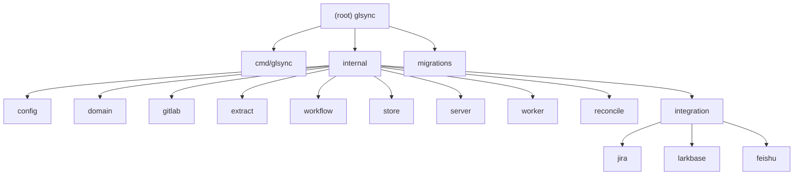

# glsync

GitLab-to-Jira synchronisation service. Listens for GitLab webhook events (push and merge-request), extracts Jira issue keys from branch names and MR titles, then drives the target Jira ticket through its workflow states. Supports async job processing with exponential-backoff retries, a stuck-job reconciler, and an optional in-progress date strategy.

---

## Architecture Overview

```
GitLab  ──POST──►  /api/v1/webhooks/gitlab
                        │
                   [server]
                   validate token
                   parse + normalise event
                   extract issue keys
                   classify workflow state
                   persist event
                   enqueue jobs
                        │
              ┌─────────┘
              │
         [worker / Processor]
         dequeue (SELECT FOR UPDATE SKIP LOCKED)
              │
         [worker / Executor]
         ├─ jira_transition  ──► Jira REST API v2
         ├─ larkbase_sync    (stub, no-op)
         └─ feishu_notify    (stub, no-op)
              │
         [reconcile / Reconciler]
         resets stuck "running" jobs every 15 min
```

Key design choices:
- Single binary, no external message broker — PostgreSQL is the durable job queue.
- All downstream logic is isolated behind interfaces (`store.EventRepository`, `store.JobRepository`, `jira.Transitioner`), making each layer independently testable.
- Configuration is layered: YAML file, then `GLSYNC_`-prefixed env var overrides (via koanf).

---

## Module Structure



---

## Module Index

| Path | Responsibility |
|------|---------------|
| `cmd/glsync` | Binary entry point — wires all components and starts the server |
| `internal/config` | Layered config loader (YAML + env vars via koanf) |
| `internal/domain` | Pure value types: `NormalizedEvent`, `Job`, `AuditEntry`, `WorkflowState` |
| `internal/gitlab` | Webhook token validation, payload parsing (push / MR), idempotency key construction |
| `internal/extract` | Regex-based Jira issue key extractor from branch names and MR titles |
| `internal/workflow` | Classify event → target state; resolve state → Jira transition ID; calculate due dates |
| `internal/store` | pgx/v5 repository implementations for events, jobs, and audit logs |
| `internal/server` | chi HTTP router, webhook handler, health/readiness, admin list endpoints |
| `internal/worker` | Concurrent job processor (poll + semaphore), executor that calls Jira |
| `internal/reconcile` | Background loop that resets stuck `running` jobs back to `pending` |
| `internal/integration/jira` | Jira REST API v2 client: `TransitionIssue`, `GetStoryPoints`, etc. |
| `internal/integration/larkbase` | Stub: deployment-record interface + no-op implementation |
| `internal/integration/feishu` | Stub: group-notification interface + no-op implementation |
| `migrations` | golang-migrate SQL files for `events`, `jobs`, `audit_logs` tables |

---

## HTTP Endpoints

| Method | Path | Purpose |
|--------|------|---------|
| `POST` | `/api/v1/webhooks/gitlab` | Receive GitLab webhook events |
| `GET` | `/healthz` | Liveness probe (always 200) |
| `GET` | `/readyz` | Readiness probe (pings DB) |
| `GET` | `/api/v1/admin/events?limit=N` | List recent events (default 50, max 500) |
| `GET` | `/api/v1/admin/jobs/failed` | List failed and dead jobs |

> Admin endpoints have no authentication yet. Add an IP allowlist or token before exposing externally.

---

## Webhook → Jira State Mapping

| GitLab Event | Condition | Jira Transition |
|---|---|---|
| Push (`object_kind: push`) | New branch only (`before == 0000…`) | `in_progress` |
| MR opened / reopened / update (non-draft) | — | `code_review` |
| MR merged | target branch = `develop` | `rfqa` |
| MR merged | target branch = `master` | `done` |
| MR draft / unrecognised | — | ignored |

---

## Running & Development

```bash
# Prerequisites: Go 1.25, PostgreSQL 16

# 1. Start local DB
make dev-db

# 2. Copy and edit secrets
cp .env.example .env
# fill GLSYNC_GITLAB_WEBHOOK_SECRET, GLSYNC_JIRA_USERNAME, GLSYNC_JIRA_API_TOKEN

# 3. Apply migrations
make migrate-up

# 4. Run
make run

# 5. Build binary
make build

# 6. Build Docker image
make docker-build
```

Default port: **8090**. Config file: `config/glsync.yaml`.

### Environment Variables (override YAML)

| Variable | YAML key | Example |
|---|---|---|
| `GLSYNC_GITLAB_WEBHOOK_SECRET` | `gitlab.webhook_secret` | `s3cr3t` |
| `GLSYNC_JIRA_USERNAME` | `jira.username` | `user@corp.com` |
| `GLSYNC_JIRA_API_TOKEN` | `jira.api_token` | `ATATT3x…` |
| `GLSYNC_DATABASE_URL` | `database.url` | `postgres://…` |
| `GLSYNC_JIRA_CLOUD_ID` | interpolated in base_url | `xxxxxxxx-…` |

---

## Testing Strategy

Tests live alongside source in the same package (external `_test` packages). All use table-driven patterns with `testify`.

```bash
make test           # go test ./... -race -count=1
```

Covered packages (unit tests):
- `internal/extract` — issue key regex, deduplication, priority rules
- `internal/workflow` — state classification, transition resolver, due-date strategies
- `internal/gitlab` — webhook token validation

Not yet covered (gaps):
- `internal/store` — requires a live or dockerised PostgreSQL instance
- `internal/worker` — integration test for the processor/executor loop
- `internal/server` — HTTP handler integration tests
- `internal/reconcile` — no tests

---

## Coding Standards

- Language: Go 1.25. Module: `gitlab.surya-am.com/sam/risk/glsync`.
- Formatter: `gofmt` / `goimports` (mandatory).
- Linter: `golangci-lint` (`make lint`).
- Error wrapping: `fmt.Errorf("context: %w", err)` at every boundary.
- Interfaces defined at call site (e.g. `jira.Transitioner`, `store.JobRepository`).
- No mutation of shared state; concurrency via channels and `sync.WaitGroup`.
- Secrets: never hard-code; load from env only.

---

## AI Usage Guidelines

- The domain model (`internal/domain`) is the authoritative source of type names — always check it before generating new types.
- Jira transition IDs are environment-specific integers stored in config; do not hard-code them.
- The `larkbase` and `feishu` packages are intentional stubs — do not implement them without a separate feature branch.
- When adding a new event type, update: `domain/event.go` → `gitlab/parser.go` → `workflow/rules.go` → tests.
- The `Dequeue` query uses `SELECT FOR UPDATE SKIP LOCKED` — do not add locks elsewhere in the job lifecycle.

---

## Changelog

| Date | Change |
|---|---|
| 2026-04-08 | Initial CLAUDE.md generated by architecture scan |
